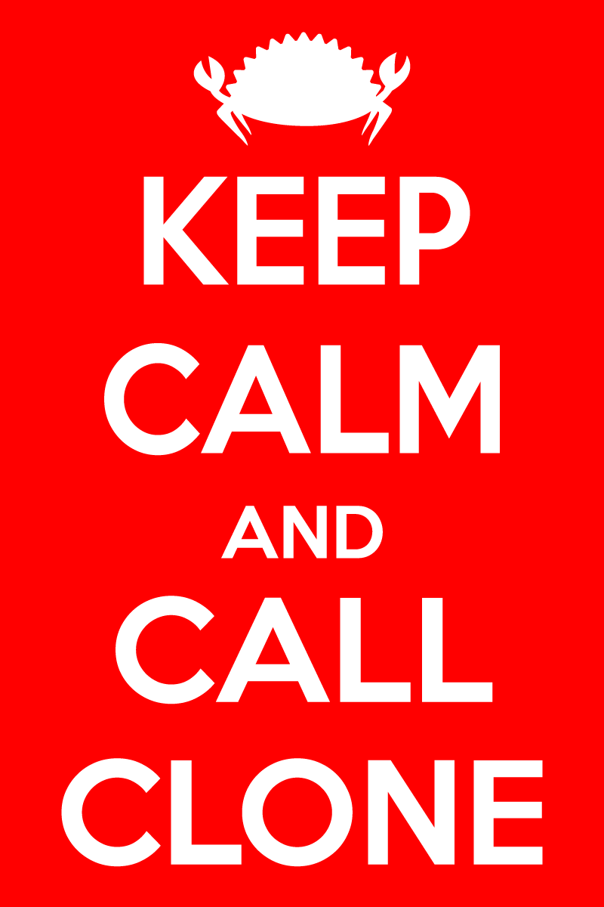

It's a [Rust](https://www.rust-lang.org/) joke.

Ferris courtesy of [Karen Rustad Tölva](https://rustacean.net/).

Made in [Inkscape](https://inkscape.org/). `keep-calm-and-call-clone.svg` is the original source file. It uses the [Keep Calm](https://www.dafont.com/keep-calm.font) font. `keep-calm-and-call-clone-rendered.svg` has the text rendered to paths so the font is not required. `keep-calm-and-call-clone.png` is the rendered PNG you see above.

To the extent possible under law, the author(s) have dedicated all copyright and related and neighboring rights to this software to the public domain worldwide. This software is distributed without any warranty.

You should have received a copy of the CC0 Public Domain Dedication along with this software. If not, see <http://creativecommons.org/publicdomain/zero/1.0/>.
